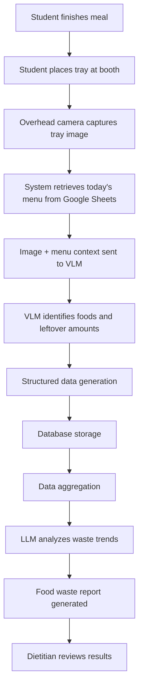

# AI Food Waste Detection System

### Requirements and Specification Document

---

# 1. Overview

School cafeterias often experience significant food waste because students leave certain foods uneaten. Identifying which foods are commonly wasted can help improve menu planning and reduce waste.

This project proposes an **AI-powered food waste analysis system** that uses computer vision and language models to analyze student trays after meals.

Students place their trays at a **collection booth**, where a **camera captures a bird's-eye view image of the plate**. The image is analyzed by a **Vision Language Model (VLM)** to identify leftover foods and estimate how much remains. The results are then stored and aggregated across many trays.

A **Large Language Model (LLM)** analyzes the aggregated data and generates a **written report explaining which foods or food categories are wasted the most**.

The system also integrates a **Google Sheets lunch menu spreadsheet** to improve food identification accuracy by providing the AI with information about which foods were served on each day.

---

# 2. System Objectives

The system aims to:

1. Capture images of student trays after meals.
2. Identify leftover foods using a Vision Language Model.
3. Use the **daily menu spreadsheet** to improve food recognition accuracy.
4. Store and organize leftover data from multiple trays.
5. Aggregate the data to identify food waste patterns.
6. Generate analytical reports for school dietitians.

---

# 3. System Architecture

The system consists of the following components:

| Component                   | Description                                      |
| --------------------------- | ------------------------------------------------ |
| Image Capture System        | Camera captures top-down images of student trays |
| Menu Data Source            | Google Sheets containing the daily lunch menu    |
| Vision Language Model (VLM) | Identifies food items and leftover quantities    |
| Data Processing Layer       | Converts AI output into structured data          |
| Database                    | Stores food waste data from many trays           |
| Large Language Model (LLM)  | Analyzes aggregated data and generates reports   |

---

# 4. Functional Requirements

---

# 4.1 Image Capture System

A camera will be installed above a tray collection booth to capture images of student trays.

### Requirements

* Camera must capture **bird's-eye view images**
* Minimum resolution: **1080p**
* Fixed camera position for consistent images
* Automatic capture when a tray is placed in the booth

Images will then be sent to the AI analysis system.

---

# 4.2 Menu Data Integration

To improve the accuracy of food recognition, the system will retrieve the **daily lunch menu from a Google Sheets spreadsheet**.

Without menu context, the VLM might confuse similar foods. For example, the system might detect **pasta** when the actual dish served was **spaghetti**.

By providing the menu to the AI model, the system limits possible predictions to foods that were actually served that day.

### Example Menu Spreadsheet

| Date       | Dish 1    | Dish 2           | Dish 3   | Dish 4 |
| ---------- | --------- | ---------------- | -------- | ------ |
| 2026-03-08 | Spaghetti | Garlic Bread     | Broccoli | Apple  |
| 2026-03-09 | Rice      | Chicken Teriyaki | Spinach  | Orange |
| 2026-03-10 | Ramen     | Dumplings        | Cabbage  | Banana |

The system retrieves the **menu for the current day** and includes it in the VLM prompt when analyzing tray images.

---

# 4.3 Food Detection Using Vision Language Model (VLM)

The VLM analyzes tray images and identifies leftover foods.

### Tasks performed by the VLM

* Detect food items on the tray
* Compare detected foods with the **daily menu**
* Estimate the percentage of each food remaining
* Return the results in structured format

### Example Prompt

```
Analyze this top-down image of a student's lunch tray.

Today's menu includes:
- Spaghetti
- Garlic bread
- Broccoli
- Apple slices

Tasks:
1. Identify which foods from today's menu appear on the tray
2. Estimate the leftover percentage of each item
3. Return results in JSON format
```

---

# 4.4 Analytics and Reporting (LLM)

Since the school menu changes daily, analyzing individual food items alone is not effective. Instead, the system categorizes foods into **specific food groups** so patterns can be detected across different menus.

These categories consider:

* Food type
* Cooking method
* Preparation style

This allows the system to determine **which types of foods students tend to waste**, even if the specific menu items change.

---

## Food Categorization System

| Category           | Example Foods                  |
| ------------------ | ------------------------------ |
| Leafy Vegetables   | Spinach, lettuce, bok choy     |
| Steamed Vegetables | Broccoli, carrots, cauliflower |
| Raw Vegetables     | Salad mix, cucumber            |
| Root Vegetables    | Potatoes, sweet potatoes       |
| Fried Proteins     | Fried chicken, pork cutlet     |
| Grilled Proteins   | Grilled chicken, steak         |
| Plant Proteins     | Tofu, beans                    |
| Rice Dishes        | White rice, fried rice         |
| Noodle Dishes      | Spaghetti, ramen               |
| Soups and Stews    | Miso soup, vegetable soup      |
| Fruits             | Apples, oranges, bananas       |
| Dairy              | Yogurt, cheese                 |

---

## Categorization Process

1. The **VLM detects food items on the tray**
2. Each food item is mapped to a **category**
3. Leftover percentages are aggregated by category
4. The **LLM analyzes trends in food waste**

---

## Example Data After Categorization

| Plate ID | Food Item | Category           | Leftover % |
| -------- | --------- | ------------------ | ---------- |
| 1023     | Broccoli  | Steamed Vegetables | 85         |
| 1023     | Rice      | Rice Dishes        | 10         |
| 1023     | Chicken   | Fried Proteins     | 5          |

---

## Aggregated Dataset

| Category           | Average Leftover % |
| ------------------ | ------------------ |
| Leafy Vegetables   | 74                 |
| Steamed Vegetables | 68                 |
| Rice Dishes        | 12                 |
| Fried Proteins     | 6                  |
| Fruits             | 18                 |

---

## Example LLM Report

Example generated report:

> Analysis of 1,200 trays shows that leafy vegetables and steamed vegetables have the highest leftover rates, averaging 74% and 68%. In contrast, fried proteins and rice dishes have the lowest waste levels. This suggests students may prefer stronger flavors and cooked textures compared to plain vegetables. Adjusting preparation methods may help reduce waste.

---

# 5. Structured Data Generation

After the VLM analyzes an image, the results are converted into **structured data** so they can be stored and analyzed.

Structured data means the results are organized into a consistent format such as **JSON or database tables**.

### Example

```json
{
  "plate_id": "2041",
  "date": "2026-03-08",
  "foods": [
    {"food_item": "broccoli", "category": "Steamed Vegetables", "leftover_percent": 80},
    {"food_item": "spaghetti", "category": "Noodle Dishes", "leftover_percent": 20},
    {"food_item": "garlic bread", "category": "Grain Dishes", "leftover_percent": 5}
  ]
}
```

This format allows the system to **store and process large amounts of tray data efficiently**.

---

# 6. Data Aggregation

Data aggregation combines results from **many trays** to identify overall patterns.

Instead of analyzing individual trays, the system calculates statistics across hundreds or thousands of plates.

Examples include:

* Average leftover percentage by category
* Most frequently wasted foods
* Trends over time

The aggregated dataset is then sent to the **LLM for analysis and report generation**.

---

# 7. System Workflow



---

# 8. Non-Functional Requirements

### Performance

* Image processing time: **under 5 seconds**
* System capable of analyzing **hundreds of trays per day**

### Accuracy

* Food detection accuracy target: **80% or higher**

### Reliability

* Automatic image upload
* Error handling for unclear images

### Privacy

* Camera only captures **trays**
* No student faces or personal data recorded

---

# 9. Expected Impact

This system can help schools:

* Reduce cafeteria food waste
* Improve menu planning
* Increase student satisfaction
* Promote sustainable food practices

By combining **computer vision, contextual menu data, and AI-driven analysis**, the system provides actionable insights for school dietitians.
 